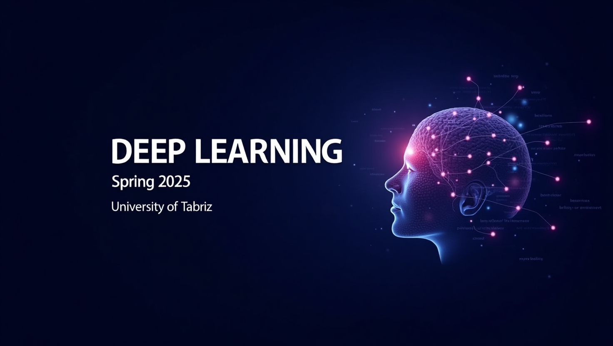

# Deep Learning Course - Spring 2025  

**University of Tabriz**  
**Instructor:** Dr. Behzad Pourmahmoud (`b.pourmahmood@tabrizu.ac.ir`)  
**Teaching Assistant (TA):** Nikan Zamani (`zamaninikan@gmail.com`)  

## **Persian version**
You can read the persian version [here](https://github.com/nikanzamani/Deep-Learning-Spring-2025/blob/main/README.fa.md) but be warned, I'm going to prioritize keeping the english version up-to-date so the persian version may be a little outdated. You are supposed to have a working knowledge of English. If you find any problem with any version of the documentation please contact me, or even better make a pull request. 

## **Prerequisites**:  
Basic Python, Linear Algebra. 

## **Course Overview**  
This course covers foundational and advanced topics in deep learning, including neural networks, optimization techniques, convolutional/recurrent networks, and real-world applications. Students will implement projects using modern frameworks like TensorFlow/PyTorch and gain hands-on experience with industry-relevant tools .  
### **Topics Covered**  
1. **Neural Networks Basics**: Perceptrons, activation functions, gradient descent .  
2. **Optimization**: Hyperparameter tuning, batch normalization, dropout .  
3. **Convolutional Networks (CNNs)**: Architectures (ResNet, VGG), transfer learning .  
4. **Recurrent Networks (RNNs)**: LSTMs, attention mechanisms .  
5. **Advanced Topics**: VAEs, transformers, Deep RL .  

## **Learning Objectives**  
By the end of the course, students will:  
- Understand the mathematical and algorithmic foundations of deep learning .  
- Design, train, and evaluate neural networks for tasks like image classification, NLP, and sequence modeling .  
- Apply optimization techniques (e.g., Adam, batch normalization) and regularization methods to improve model performance .  

## **Lecture Schedule**:  
TO BE ADDED

## **Grading Breakdown**:
Currently only the project grading breakdown is available.

### **Projects**  
| Project | Description | Deadline | Points |  
|---------|------------|----------|--------|  
| **Project 0** | Mandatory setup (environment, Git, basic PCA) | TBD | 0% |  
| **Project 1** | MLP & Backpropagation | TBD | 20% |  
| **Project 2** | CNNs for Image Classification | TBD | 20% |  
| **Project 3** | RNNs/LSTMs for Sequence Modeling | TBD | 20% |  
| **Project 4** | Capstone (Deep  RL game) | TBD | 40% |  

- **Project 0** is a prerequisite for grading other projects.  
- Deadlines and detailed rubrics will be announced per project.  
- If by any chance we couldn't reach the last project, its grade will be distributed equally between other projects  

## **Submission Guidelines**  
1. Each project will have its own `README.md` with detailed instructions, please read them carefully and ask any clarifying questions if necessary. 
2. Join the [Quera](https://quera.org/course/add_to_course/course/21935/) (password: cg0304cs) platform, all submissions will be handled through there, so don't email  the projects 
3. Submit via the Quera platform.  
4. Late submissions may incur penalties unless prior approval is granted.  

## **Communication & Support** 
Please don't hesitate to contact any of the instructors for help or clarifying questions
- **Email**: Prefix email subjects with `[DL-Spring2025]` for clarity. 
- **Telegram**: [@BPaghababa](https://t.me/BPaghababa) and [@nikanzamani](https://t.me/nikanzamani) are our telegram handles. Please keep the communication strictly to emails unless urgent response is required.  
- **FAQ**: A section will be updated periodically based on common queries.  
---

## **Resources**  
- **Textbooks**:  
  - **Deep Learning** by Ian Goodfellow .
  - **Neural Networks and Deep Learning** by Charu C. Aggarwal
- **Videos**:
  - Dr.Razavi's [youtube](https://www.youtube.com/@DrNaserRazavi) course
  - Refresher to [Math and Linear Algebra](https://www.youtube.com/watch?v=k0zKoTvngUY)
- **Tools**: PyTorch, Scikit-learn, NumPy, Jupyter Notebooks  

## **Academic Integrity Policy**  
**Plagiarism and cheating are strictly prohibited.**  
- All submissions must be your original work.  
- Collaboration is allowed only if explicitly permitted (e.g., group projects).  
- Copying code, reports, or solutions from others (including online sources) will result in **zero points** and possible disciplinary action.  
- If you use external resources (e.g., GitHub, tutorials), **cite them clearly** in your submission.
- **Zero tolerance for plagiarism**. Cite all external code/resources

## Suggestions for Students  
- Start early; deep learning projects can be time-consuming.  
- Document your code and experiments thoroughly (yes even your failures).  
- Use version control (Git) effectively and commit often with clear messages.  

